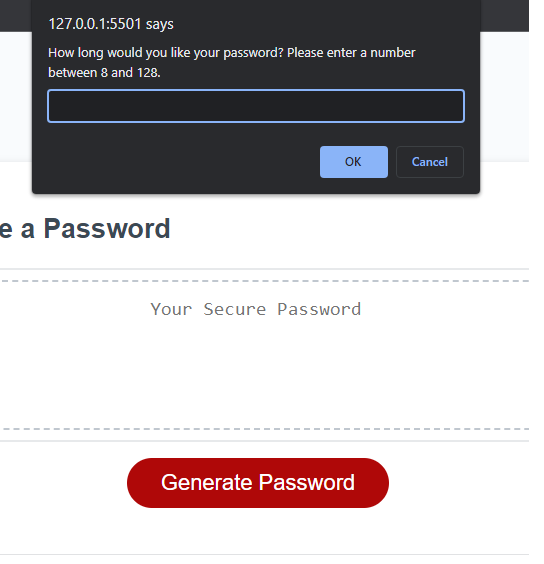
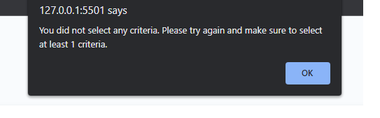

# Password-Generator
## Description
 
 This project was to create a web application that would randomly generate a password given user inputed criteria. I ask how many characters the user wants the password, as well as what type of characters they wish to include.
## Installation

N/A

## Usage

Follow this [link](https://josephfanderson.github.io/Password-Generator) to be taken to the webpage. Once there you clicking the Generate Password button will cause a series of prompts/confirm windows to appear.

Once you successfully complete all the prompts, the password will be displayed in the box above the Generate Password button.

If the user does not select any of the character criteria then an alert pops up stating No criteria selected and ask them to try again making sure to select at least 1 criteria.

## License

N/A
